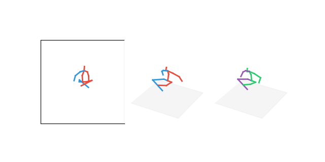

# 3d_pose_baseline_pytorch

A PyTorch implementation of a simple baseline for 3d human pose estimation.
You can check the original Tensorflow implementation written by [Julieta Martinez et al.](https://github.com/una-dinosauria/3d-pose-baseline).
Some codes for data processing are brought from the original version, thanks to the authors.

<!--  -->

This is the code for the paper

```
@inproceedings{martinez_2017_3dbaseline,
  title={A simple yet effective baseline for 3d human pose estimation},
  author={Martinez, Julieta and Hossain, Rayat and Romero, Javier and Little, James J.},
  booktitle={ICCV},
  year={2017}
}
```

## WIP

- [X] Training code
- [X] Testing code

### Datasets

- [X] Human3.6M
- [X] HumanEva

## Dependencies

* [PyTorch](http://pytorch.org/) >= 1.6.0

## Installation

1. First, clone this repository:
   ```
   git clone https://github.com/daixiangzi/3d_pose_baseline_pytorch.git
   ```
2. Download the pre-processed [Human3.6M](https://pan.baidu.com/s/1a5fIbuAyWtTkRnQZGtl72Q)(baidu cloud,password:hlbe) dataset in 3d joints
   ```
   tar -xvf human36m.tar
   rm human36m.tar
   ```

## Usage

### Data preprocess

### Train

1. Train on Human3.6M groundtruth 2d joints:

   ```
   # optional arguments, you can access more details in opt.py
   main.py [-h] [--data_dir DATA_DIR] [--exp EXP] [--ckpt CKPT]
              [--load LOAD] [--test] [--resume]
              [--action {all,All}]
              [--max_norm] [--linear_size LINEAR_SIZE]
              [--num_stage NUM_STAGE] [--use_hg] [--lr LR]
              [--lr_decay LR_DECAY] [--lr_gamma LR_GAMMA] [--epochs EPOCHS]
              [--dropout DROPOUT] [--train_batch TRAIN_BATCH]
              [--test_batch TEST_BATCH] [--job JOB] [--no_max] [--max]
              [--procrustes]
   ```

   train the model:

   ```
   python main.py --exp example 
   ```

### Test

1. You can test on ground-truth 2d pose for a quick demo.

   ```
   python main.py --load $PATH_TO_gt_ckpt_best.pth.tar --test
   ```

   and you will get the results:

   |                 | direct. | discuss. | eat. | greet. | phone | photo | pose | purch. | sit | sitd. | somke | wait | walkd. | walk | walkT | avg |
   | :--------------: | :-----: | :------: | :--: | :----: | :---: | :---: | :--: | :----: | :--: | :---: | :---: | :--: | :----: | :--: | :---: | :--: |
   | original version |  37.7  |   44.4   | 40.3 |  42.1  | 48.2 | 54.9 | 44.4 |  42.1  | 54.6 | 58.0 | 45.1 | 46.4 |  47.6  | 36.4 | 40.4 | 45.5 |
   | pytorch version |  35.7  |   42.3   | 39.4 |  40.7  | 44.5 | 53.3 | 42.8 |  40.1  | 52.5 | 53.9 | 42.8 | 43.1 |  44.1  | 33.4 | 36.3 |  -  |
### Vis
```
CUDA_DEVICE_ORDER=PCI_BUS_ID CUDA_VISIBLE_DEVICES='5' python3 test.py --test_dir ./data --checkpoint ./checkpoint/ckpt_best.pth.tar
```
#### Result 

 
## License

MIT
